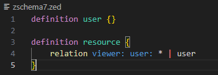
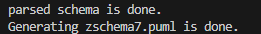
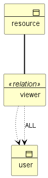
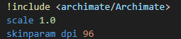
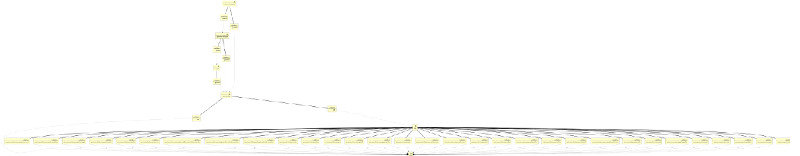

# Zanzibar SpiceDB-like Reader +  Archimate PlantUML Generation Code  in less than 900 lines of golang : part IV

This part follows parts I,II and III from Zanzibar SpiceDB-like Reader.

This time, I wanted to integrate the wildcard  feature. 

This is the last feature to be implemented to cover all the features of the relationships in SpiceDB.


# “Wildcard” Feature

This feature is described in the zanzibar documentation.

The spicedb/authzed documentation explains :

> Relations can also specify wildcards to indicate that a grant can be made to the resource type as a whole, rather than a particular resource. 
> This allows public access to be granted to a particular subect type.

So I have added in the grammar the part   as follows, to be able to modify the lexical analysis.

(This is still the hardest part of design)

# BNF grammar with Wildcard feature

```
// Zanzibar restricted EBNF grammar
// SpiceDB like
// Only relations are declared (not permissions)

<Zschema> ::= <Zdef>*
<Zdef> ::= "definition" <Zname> "{" <Zbody> "}"  ---> generation
<Zname> ::= <identifier>
<Zbody> ::= <Zrelation>*
<Zrelation> ::= "relation" <Rname> ":" <Sname> ("|" <Sname)*   ---> generation 
<Rname> ::= <identifier> 
<Sname> ::= <Zname> | <Zname> "#" <Rname> | <Zname> ":" "*"
<identifier> ::= [a-zA-Z_][a-zA-Z0-9_]*

```

# Example

I take the original example of spiceDB/authzed documentation :

A viewer might indicate that all users can be granted the ability to view the resource.




<span style="color:yellow">tape :</span> go run zreader.go -fschema "./zschema7.zed" -out "zschema7"

<span style="color:yellow">response: </span>




As previously in part II and III, even if the parser detects errors, it tries to draw what it can


Using the generated zedschema7.puml file with PlantUML helps us to show the Archimate following diagram :



I decided to draw the two declarations of user and user:*

PS : By default the generated plantuml code now starts with



These two parameters scale and dpi allow you to zoom in or out while maintaining a sufficient resolution

For the following diagram i changed the values in teh file with scale = 0.15 and dpi = 300

(The diagram used comes from the google IAM schema of the doc authzed/spicedb (without the declaration of permissions))




# Help mode

<span style="color:yellow">tape :</span> go run zreader.go -help

#

About Zanzibar : https://storage.googleapis.com/pub-tools-public-publication-data/pdf/0749e1e54ded70f54e1f646cd440a5a523c69164.pdf

About SpiceDB : https://authzed.com/blog/spicedb-is-open-source-zanzibar#everybody-is-doing-zanzibar-how-is-spicedb-different

About PlantUML : https://plantuml.com/fr/download
